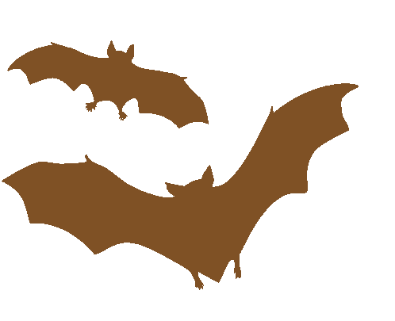

## Olá!  
Eu sou o Moa.

 

(DataBricks | Power BI | SQL | Python | GIT | Linux) 🚀

- 👨‍💻 Analytics Engineer Pleno na <a href="https://www.cacaushow.com.br/" target="_blank">Cacau Show 🤎</a>
- 🎓 Engenharia da Computação (Graduação)
- 🎓 MBA em Data Science e Analytics (USP)
- 🌱 Aprendendo Power BI, SQL e Python todos os dias
- 💖 Apaixonado por dados
- 🏆 Amo um desafio
- 🤘🏻 Sempre ouvindo um bom rock

##

<!-- Este bloco carrega o jogo que criamos na automação -->
<picture>
  <source media="(prefers-color-scheme: dark)" srcset="https://raw.githubusercontent.com/moaramos/moaramos/output/pacman-contribution-graph-dark.svg">
  <source media="(prefers-color-scheme: light)" srcset="https://raw.githubusercontent.com/moaramos/moaramos/output/pacman-contribution-graph.svg">
  
</picture>
